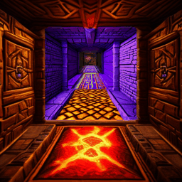
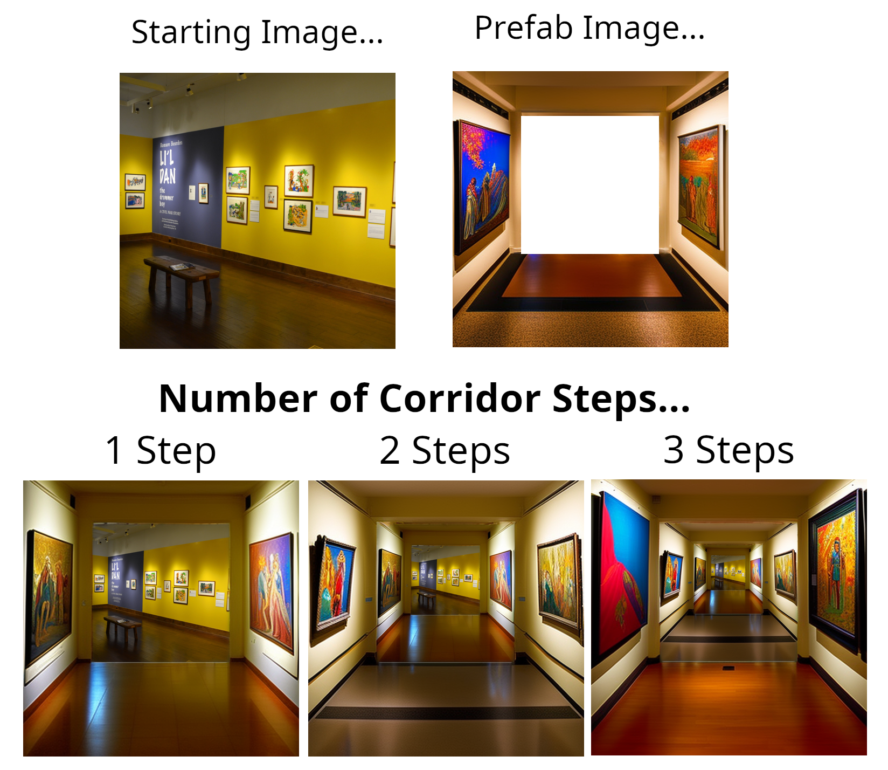

# Corridor Crawler Outpainting
An [automatic1111/stable-diffusion-webui](https://github.com/AUTOMATIC1111/stable-diffusion-webui) extension for generating and animating hallways with Stable Diffusion. It was designed to use [depth-to-image model](https://huggingface.co/stabilityai/stable-diffusion-2-depth/blob/main/512-depth-ema.ckpt) at 512 resolution, but it could be tweaked to work with other models.

## Examples

Prefab Image: fantasy-dungeon-red-carpet.png

Positive Prompt: ((Fantasy dungeon hallway)), intricate, (engraved smoothed stone walls), brightly-lit, [vivid colors], glowing lights, trending on ArtStation, (fancy carpet), insanely detailed, masterpiece, cinematic lighting

Negative Prompt: ((Dark)), (red), black, (shadow), grey, blurry, watermark, signature

Sampling Steps = 30

CFG Scale = 10

Denoising strength = 1

Prefab Image: art-museum.png

Positive Prompt: (Art museum hallway), masterpiece art, wall paintings, colorful, award-winning photography, beautiful lighting, detailed

Negative Prompt: Blurry, dark, watermark, signature

Sampling Steps = 30

CFG Scale = 10

Denoising strength = 1

## How to install
Option #1: Run automatic1111, install "Corridor Crawler Outpainting" from the Extensions tab, then reset UI.

Option #2: Clone this repo into the automatic1111 "extensions" folder.

## How to use
1. Run [automatic1111/stable-diffusion-webui](https://github.com/AUTOMATIC1111/stable-diffusion-webui) and make sure your selected model is [512-depth-ema.ckpt](https://huggingface.co/stabilityai/stable-diffusion-2-depth/blob/main/512-depth-ema.ckpt)
2. Go to "img2img" then select the tab "Inpaint upload"
3. For the mask image, make sure you select "default-mask.png" from this repo. The other image can be your choice. (TODO: Make mask selection automatic)
4. Select "Corridor Crawler Outpainting" from the Scripts dropdown menu, then configure your chosen prefab image and other settings.

(TODO: Add tutorial images and recommended settings)

## Credits

Created by brick2face

Special thanks to dungeoncrawlers.org for their "Atlas Generator" which was used to generate the first prefab image (simple-brick-textures.png). It can be used to make additional prefab images: https://dungeoncrawlers.org/tools/atlas_generator/
